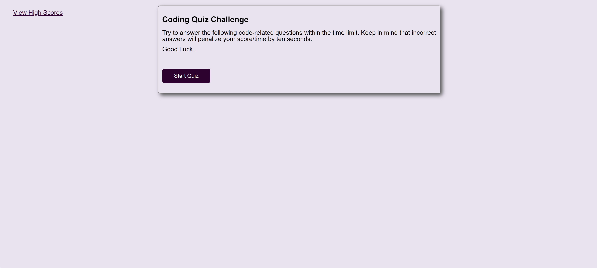
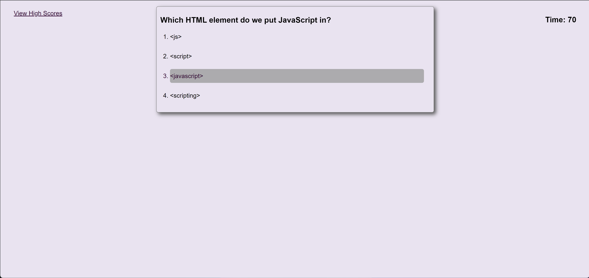
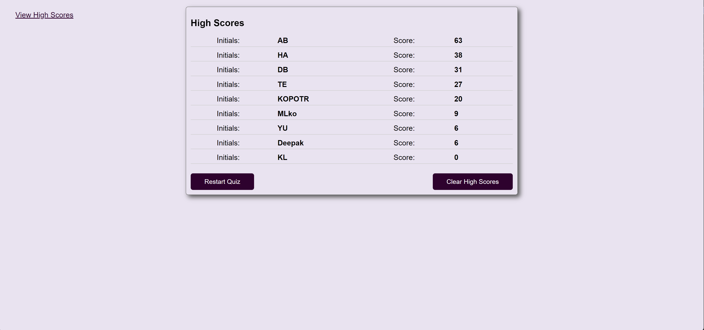

# Online Quiz
Online quiz application with multiple choice answers and timer.

## Technology Used 

| Technology Used         | Resource URL           | 
| ------------- |-------------| 
| JavaScript    | [https://developer.mozilla.org/en-US/docs/Web/JavaScript](https://developer.mozilla.org/en-US/docs/Web/JavaScript) | 
| HTML    | [https://developer.mozilla.org/en-US/docs/Web/HTML](https://developer.mozilla.org/en-US/docs/Web/HTML) | 
| CSS     | [https://developer.mozilla.org/en-US/docs/Web/CSS](https://developer.mozilla.org/en-US/docs/Web/CSS)      |   
| Git | [https://git-scm.com/](https://git-scm.com/)     |    

## Description
[Online Quiz](https://dee-here.github.io/multiple-choice-quiz/)

This project was to build an online quiz application. 
When a user launches this application, they see a start screen which has a "Start Quiz" button. 

Clicking on the "Start Quiz" button displays a screen with a question and multiple choices.
A timer is also started for 75 seconds.

Clicking on one of the options for the questions, will take the user to the next question.

If the answer is incorrect, the Time is reduced by 10.

If time runs out, the User is brought to a screen, where they can enter their initials and high score. 
The high scores are saved in the browser. There is also a "View High Scores" link that the user can click to see the saved high scores.
After saving their initials and score, the user is shown the high scores screen. The high scores screen, displays all the scores sorted from high score to low.
On this High Scores screen, the user can also clear the saved high scores using the "Clear High Scores" button. Users can also go back to re take the quiz with the "Restart Quiz" button.

## Screenshots

## Author Info
Deepak Sinha

* [Portfolio](https://dee-here.github.io/portfolio/)
* [Github](https://github.com/dee-here)
